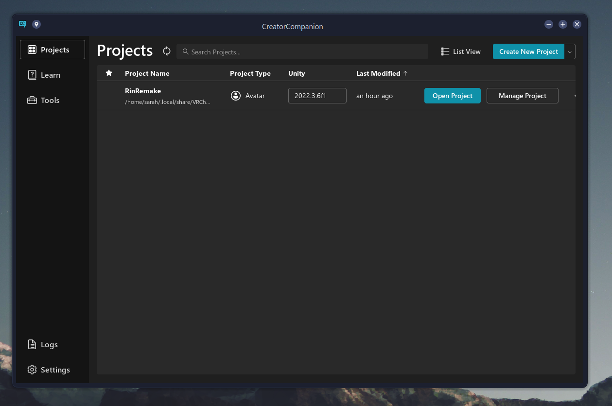

<div align="center">
<h3 align="center">LinuxCreatorCompanion</h3>

  <p align="center">
    A Wrapper around VRChat's Creator Companion to make it work on Linux
    <br />
    <br />
    <a href="https://github.com/RinLovesYou/LinuxCreatorCompanion/issues">Report Bug</a>
    ·
    <a href="https://github.com/RinLovesYou/LinuxCreatorCompanion/issues">Request Feature</a>
  </p>
</div>

## Disclaimer
This is a *dirty* port. Things have been hastily patched for surface level functionality. <br>
In the future I will clean things up, make the install process more automated, etc.

---



## Setup
You must install the [VRChat Creator Companion](https://vcc.docs.vrchat.com/) via wine first.

As it would be rather dubious to distribute anything from the Creator Companion, you'll need to run a setup.<br>
If you installed the Creator Companion by just running `wine VRChat_CreatorCompanion_Setup_x.x.x.exe`<br>

You can run the following command to get the files you need:
```
./LinuxCreatorCompanion --setup "/home/$(whoami)/.wine/drive_c/users/$(whoami)/AppData/Local/Programs/VRChat Creator Companion/"
```

This will copy all the Assets, and dump the needed DLLs in your current directory. Now you can run
```
./LinuxCreatorCompanion
```

The LinuxCreatorCompanion has *only* been tested on Arch Linux, and as such, might not be able to find<br>
the paths for Unity/UnityHub. Currently the manual specifying of paths has not been properly implemented, so I would<br>
appreciate if you opened an Issue.

If you find your windows flickering while resizing, This seems to be a WebKit issue. `WEBKIT_DISABLE_COMPOSITING_MODE=1` may fix this.

---

## What works?
The surface level functionality has been tested.

* Projects can be created and managed
* Packages can be installed
* Unity can be launched

If you find any problems, please open an Issue.

---

## Building
You will need to grab the following files from your LinuxCreatorCompanion directory, after running the setup above.
* CreatorCompanion.dll
* vcc-lib.dll
* vpm-core-lib.dll

And place them in a `Libs` folder in the Solution Directory.

---

LinuxCreatorCompanion is not endorsed by VRChat and does not reflect the views or opinions of VRChat or anyone officially involved in producing or managing VRChat properties. VRChat and all associated properties are trademarks or registered trademarks of VRChat Inc. VRChat © VRChat Inc.